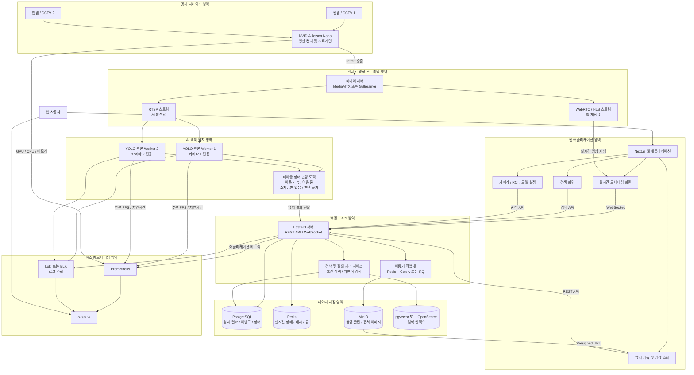

#KDT 

---
# 프로젝트
[전체 아키텍쳐](https://mermaid.ai/view/4d44c01a-49ad-42a4-a3e9-eee3864240c0)

### mermaid 사용

### 스케줄 관련
11일은 목업이 나와야 함

바이브코딩 - 내일 배포
깃헙 관련 학습 진행 예정

FastAPI 사용
DB 연결(mongoDB)

Docker 사용 관련
DB만 도커로 팀끼리 공유

바이브코딩 - MCP모듈 + 스킬 구현 필요
바이브코딩을 위한 아키텍쳐 구성

17일 CCTV 도입
1. 데이터 수집해와야 함 목업 전에 데이터 어느 정도 수집 필요
   노트북 등으로 페이스 디텍팅
   딥러닝까지의 한 사이클을 돌릴 정도의 데이터 수집
2. IP 통과 관련 테스트 필요
   노트북으로 해봐야 함, 영상 모니터링 되는지 여부

### 오늘 내로 해야 될 작업:
- [x] 팀 레포지토리 새로 만들기 + 템플릿화해서 푸시해놓기 ✅ 2026-08-05
- [x] 프로젝트 구조 초안 만들기, 기술 스택(3티어 및 핵심 기술) 설정 ✅ 2026-08-05
- [x] AGENTS.md, 스킬 및 스펙 설정 ✅ 2026-08-05
- [ ] 통신 관련(포트 포워딩, 컨테이너 구성)
- [ ] API 명세서(Swagger?)
- [x] FastAPI + Jinja2로 웹 정상작동 확인 ✅ 2026-08-05
      인메모리 어댑터 + uvicorn
- [ ] 팀 디자인 패턴 정립

디렉토리 구조:
webapps -> fastapi
docs -> 여기에 skills 등 에이전트 관련 md파일도 저장
RPAs

브랜치는 일단 main만 냅두고, vscode 디버깅 모드 적용

CCTV 전까지:
개인 작업 PC 포트포워딩 설정(포트 개방이랑 네트워크 설정)
영상은 일단 개인 작업 PC에 저장되도록 설정(gitignore처리)
데이터 수집은 가장 구도가 비슷한 위치에서 개별적으로 촬영

==찾아봐야 할 내용:==
CCTV 영상이 실시간 프레임으로 날아오고 딥러닝으로 넘어가는 과정 설계
스트리밍되는 프레임수랑 영상으로 저장되는 프레임수가 다를 것임
RTSP?
쏴주는 방식이 뭔지, PC에서 그냥 해당 IP로 들어가면 되는 건지
분석 worker가 처리하면 되는 부분 아닌지?

