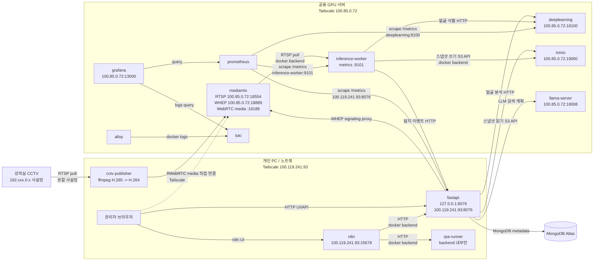

#KDT 

---

```mermaid
flowchart LR
    CCTV["강의실 CCTV<br/>192.xxx.0.x 사설망"]

    subgraph PC["개인 PC / 노트북<br/>Tailscale 100.119.241.93"]
        Browser["관리자 브라우저"]
        FastAPI["fastapi<br/>127.0.0.1:8076<br/>100.119.241.93:8076"]
        N8N["n8n<br/>100.119.241.93:15678"]
        RPA["rpa-runner<br/>backend 내부만"]
        Publisher["cctv-publisher<br/>ffmpeg H.265 -> H.264"]
    end

    subgraph GPU["공용 GPU 서버<br/>Tailscale 100.85.0.72"]
        MediaMTX["mediamtx<br/>RTSP 100.85.0.72:18554<br/>WHEP 100.85.0.72:18889<br/>WebRTC media :18189"]
        Worker["inference-worker<br/>metrics :9101"]
        DL["deeplearning<br/>100.85.0.72:18100"]
        MinIO["minio<br/>100.85.0.72:19000"]
        LLM["llama-server<br/>100.85.0.72:18008"]
        Prom["prometheus"]
        Grafana["grafana<br/>100.85.0.72:13000"]
        Loki["loki"]
        Alloy["alloy"]
    end

    Atlas[("MongoDB Atlas")]

    CCTV -->|"RTSP pull<br/>로컬 사설망"| Publisher
    Publisher -->|"RTSP push<br/>Tailscale"| MediaMTX
    MediaMTX -->|"RTSP pull<br/>docker backend"| Worker

    Browser -->|"HTTP UI/API"| FastAPI
    Browser -->|"n8n UI"| N8N
    Browser -.->|"WebRTC media 직접 연결"| MediaMTX

    FastAPI -->|"MongoDB metadata"| Atlas
    FastAPI -->|"얼굴 분석 HTTP"| DL
    FastAPI -->|"스냅샷 읽기 S3 API"| MinIO
    FastAPI -->|"LLM 검색 계획"| LLM
    FastAPI -->|"WHEP signaling proxy"| MediaMTX

    Worker -->|"탐지 이벤트 HTTP"| FastAPI
    Worker -->|"얼굴 식별 HTTP"| DL
    Worker -->|"스냅샷 쓰기 S3 API<br/>docker backend"| MinIO

    N8N -->|"HTTP<br/>docker backend"| FastAPI
    N8N -->|"HTTP<br/>docker backend"| RPA

    Prom -->|"scrape /metrics<br/>100.119.241.93:8076"| FastAPI
    Prom -->|"scrape /metrics<br/>deeplearning:8100"| DL
    Prom -->|"scrape /metrics<br/>inference-worker:9101"| Worker
    Grafana -->|"query"| Prom
    Grafana -->|"logs query"| Loki
    Alloy -->|"docker logs"| Loki

```
