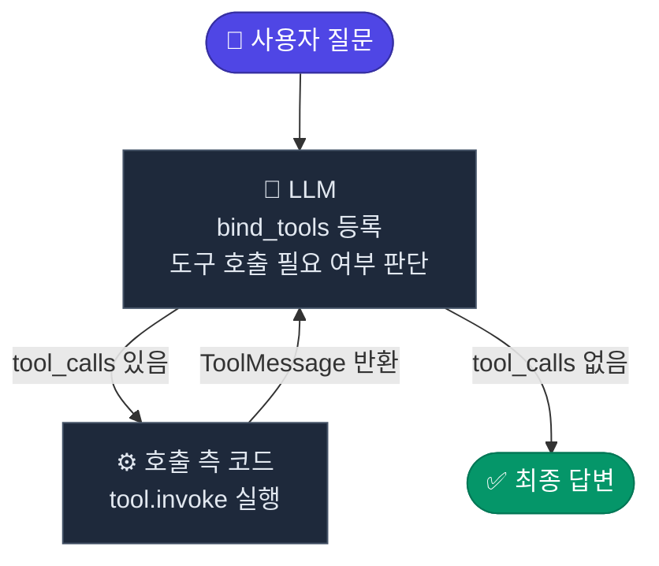

#LangChain
#LLM
#AI 

---
# Tools
LLM에 외부 기능을 연결하기 위해 사용

도구를 통해 LLM은 학습 시점 이후의 정보 조회, 외부 시스템 연동, 결정적 연산 등 자체 능력의 한계를 보완

### `@tool` 데코레이터
일반 Python 함수를 LLM이 호출할 수 있는 도구로 변환해줌

작성 규칙
1. **docstring**: 도구의 용도를 기술
   LLM이 어떤 상황에서 이 도구를 호출할지 판단하는 핵심 근거가 됨
2. **타입 힌트**: 파라미터의 JSON 스키마로 자동 변환됨
3. **반환값**: `str`, `dict`, `list` 등 JSON 직렬화 가능한 형태 권장

```python
from langchain.tools import tool

@tool
def get_schedule(date: str) -> list[dict]:
    """주어진 날짜(YYYY-MM-DD 형식)의 사내 일정 목록을 조회합니다.

    예: get_schedule("2026-04-15")
    """
    # 실제 HR/캘린더 시스템 대신 하드코딩된 시뮬레이션
    fake_db = {
        "2026-04-15": [
            {"time": "10:00", "title": "주간 팀 스탠드업", "room": "회의실 A"},
            {"time": "14:00", "title": "고객 데모 미팅", "room": "Zoom"},
        ],
        "2026-04-16": [
            {"time": "09:30", "title": "분기 OKR 리뷰", "room": "대회의실"},
        ],
    }
    return fake_db.get(date, [])

# 도구의 메타데이터 확인
print("이름:", get_schedule.name)
print("설명:", get_schedule.description)
print("인자 스키마:")
import json
print(json.dumps(get_schedule.args_schema.model_json_schema(), ensure_ascii=False, indent=2))
```

출력값:
```
이름: get_schedule
설명: 주어진 날짜(YYYY-MM-DD 형식)의 사내 일정 목록을 조회합니다.

    예: get_schedule("2026-04-15")
인자 스키마:
{
  "description": "주어진 날짜(YYYY-MM-DD 형식)의 사내 일정 목록을 조회합니다.\n\n예: get_schedule(\"2026-04-15\")",
  "properties": {
    "date": {
      "title": "Date",
      "type": "string"
    }
  },
  "required": [
    "date"
  ],
  "title": "get_schedule",
  "type": "object"
}
```

도구를 코드에서 직접 실행할 때는 `.invoke()` 메서드를 사용
```python
result = get_schedule.invoke({"date": "2026-04-15"})
print(result)
```

### 외부 API 도구 - Tavily 웹 검색
**Tavily**는 LLM 에이전트의 사용 사례에 최적화된 웹검색 API로, 최신 정보 조회에 활용됨

### 모델에 도구 등록
`llm.bind_tools([...])`는 모델이 응답 시 **도구 호출 스키마를 인식하고 활용할 수 있도록** 도구 목록을 모델에 결합함

이 메서드는 **도구를 직접 실행하지 않음**

### Tool Calling 처리 흐름



이 처리 사이클이 **ReAct(Reason → Act → Observe) 패턴**의 기본 구조

### 응답 객체
도구 호출이 발생하면 응답 객체에서 두 가지 변화가 있음
- `response.content`: 빈 문자열(`""`)
- `response.tool_calls`: 모델이 실행 요청한 도구의 이름과 인자 목록

모델은 실행 요청만 생성하며, 실제 도구 실행은 호출 측 코드에서 직접 수행 필요

